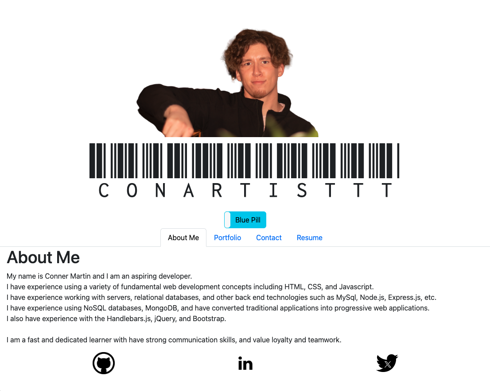
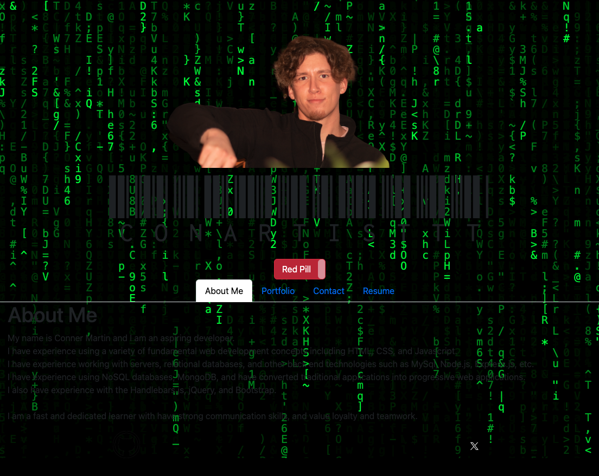

# React Portfolio

## Table of Contents

[Description](#description)
 
[Technologies Used](#technologies-used)
 
[Credits](#credits)

## Description

This is my single-page React portfolio to share my projets.

This application is deployed using Netlify [here](https://65eb7d3993097c141cfe7fce--conartisttt.netlify.app/)

A screenshot of the application:

## Technologies Used

- JSX
- React
- React Router
- Vite (local development server)

## Credits
* Matrix Effect Component by Pablo.GG, or blopa on github
* Application written by Conner Martin aka Conartisttt

